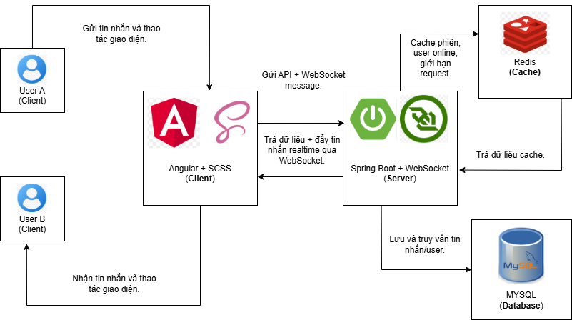
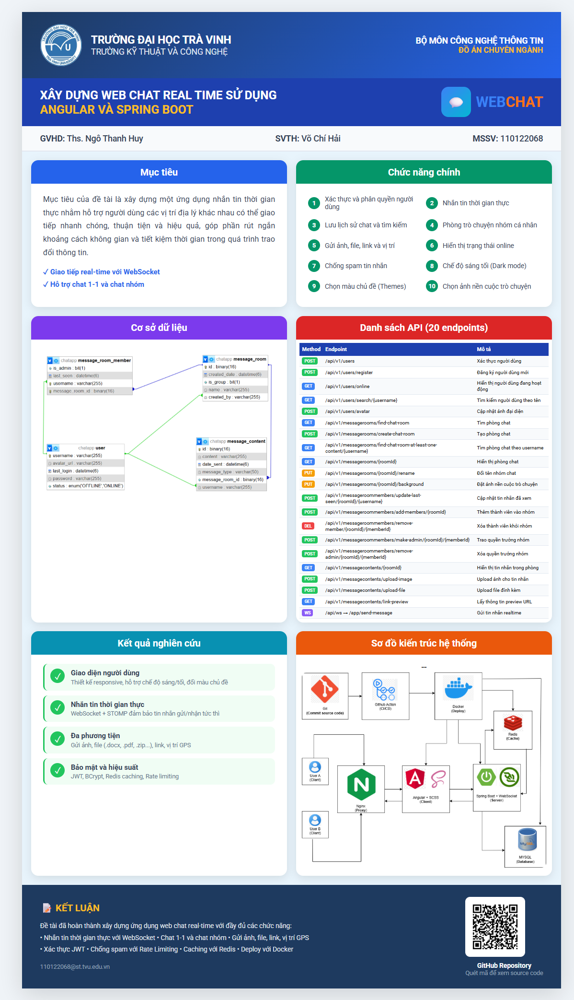

# Tên đề tài: Xây dựng web chat real-time sử dụng Angular và Spring Boot
 <br>

[](https://spring.io/projects/spring-boot)
[](https://angular.io/)
[](https://www.mysql.com/)
[](https://sass-lang.com/)<br>
  **Giáo viên hướng dẫn:** Ths. Ngô Thanh Huy<br>
  **Thời gian thực hiện:** Từ ngày 03/11/2025 đến 28/12/2025<br>
  **Sinh viên thực hiện:** Võ Chí Hải<br>
  **MSSV:** 110122068<br>
  **Email:** 1110122068@st.tvu.edu.vn<br>
 
## Mô tả hệ thống
 Dự án **web Chat Realtime** là một hệ thống trò chuyện trực tuyến được xây dựng bằng **Angular**, **SCSS** cho giao diện hiện đại và **Spring Boot**, **MySQL** cho xử lý và lưu trữ dữ liệu phía server. Ứng dụng cho phép chat 1-1, chat nhóm, tạo nhóm mới, chuyển quyền trưởng nhóm, hỗ trợ dark mode giúp trải nghiệm thân thiện với người dùng. Người dùng có thể upload avatar cá nhân, xem danh sách người dùng online, các cuộc trò chuyện gần đây, đồng thời mỗi tin nhắn đều hiển thị thời gian gửi và trạng thái đã xem. Hệ thống mang đến trải nghiệm trò chuyện mượt mà, realtime và bảo mật, đáp ứng nhu cầu giao tiếp nhanh chóng, tiện lợi trong môi trường trực tuyến.

## 📌 Sơ đồ kiến trúc hệ thống


## 📌 Poster đề tài

## Cơ sở dữ liệu
<p align="center">
  
</p>


## ✨ Tính năng

### 🔐 Bảo mật & Xác thực
- **JWT Authentication** - Xác thực người dùng bằng JSON Web Token
- **Mã hóa mật khẩu BCrypt** - Bảo mật mật khẩu với thuật toán BCrypt
- **Khóa tài khoản** - Tự động khóa tài khoản 1 giờ sau 3 lần nhập sai mật khẩu
- Đăng ký và đăng nhập người dùng
- Cập nhật thông tin cá nhân
- Upload và quản lý avatar
- Hiển thị trạng thái online/offline
- Tìm kiếm người dùng

### 💬 Nhắn tin
- Gửi tin nhắn realtime qua WebSocket
- **Emoji Picker** - Chọn và gửi emoji trong tin nhắn
- **Chia sẻ vị trí GPS** - Gửi vị trí hiện tại với bản đồ Google Maps
- Hỗ trợ nhiều loại tin nhắn (text, image, file, location)
- Upload và gửi file đính kèm
- Hiển thị trạng thái đã đọc/chưa đọc
- Rate limiting để tránh spam (Redis)

### 🏠 Phòng chat
- Tạo phòng chat 1-1 và nhóm
- **Đổi tên nhóm** - Admin có thể đổi tên nhóm chat
- **Hiển thị avatar thành viên** - Xem avatar của các thành viên trong nhóm
- Quản lý thành viên phòng chat
- Chuyển quyền trưởng nhóm
- Xem danh sách phòng chat
- Tìm kiếm và lọc phòng chat
- Tự động tạo room key duy nhất

### 🎨 Giao diện
- **Dark/Light Mode** - Chuyển đổi giao diện sáng/tối
- **Đa màu chủ đề** - Hỗ trợ nhiều màu chủ đề (cam, xanh dương, xanh lá, tím, hồng)
- Giao diện responsive, thân thiện với người dùng
- Hoàn toàn bằng tiếng Việt

### ⚡ Hiệu năng
- Cache dữ liệu với Redis
- WebSocket cho giao tiếp realtime
- Rate limiting với Redis
- Tối ưu truy vấn database

---

## 🛠 Công nghệ sử dụng

### Backend


- **Spring Boot 3.4.12** - Framework Java
- **Spring Security** - Bảo mật với JWT
- **Spring WebSocket** - Giao tiếp realtime
- **Spring Data JPA** - ORM
- **MySQL 8.0** - Database
- **Redis 7** - Cache, Rate limiting & Login attempt tracking
- **JWT (jjwt)** - JSON Web Token authentication
- **BCrypt** - Mã hóa mật khẩu
- **Lombok** - Giảm boilerplate code
- **Swagger/OpenAPI** - API documentation
- **Maven** - Build tool

### Frontend


- **Angular 16** - Framework TypeScript
- **PrimeNG 16** - UI Component library
- **@ctrl/ngx-emoji-mart** - Emoji picker component
- **STOMP.js** - WebSocket client
- **RxJS** - Reactive programming
- **SCSS** - Styling

### DevOps


- **Docker & Docker Compose** - Containerization
- **Nginx** - Web server cho frontend
- **RedisInsight** - Redis monitoring tool

---

## 📦 Yêu cầu hệ thống

### Chạy với Docker


- Docker Desktop 20.10+
- Docker Compose 2.0+
- 4GB RAM trở lên

### Chạy Local


- **Java 17** hoặc cao hơn
- **Node.js 16+** và npm
- **Maven 3.8+**
- **MySQL 8.0**
- **Redis 7**

---

## 🚀 Hướng dẫn cài đặt

### 1. Chạy với Docker (Khuyến nghị)

#### Bước 1: Clone dự án

```bash
git clone https://github.com/haivoDA22TTD/cn-DA22TTD-vochihai-webchatRealTime-Spring-Boot
cd cn-DA22TTD-vochihai-chat-app-real-time-Spring-Boot
```

#### Bước 2: Cài đặt PrimeNG Themes (Bắt buộc)

Trước khi build, bạn cần cài đặt themes cho PrimeNG:

```bash
cd frontend

# Cài đặt dependencies
npm install

# Tạo thư mục themes
mkdir -p src/assets/themes

# Copy themes từ node_modules
cp -r node_modules/primeng/resources/themes/lara-light-blue src/assets/themes/
cp -r node_modules/primeng/resources/themes/lara-dark-blue src/assets/themes/
cp -r node_modules/primeng/resources/themes/lara-light-teal src/assets/themes/
cp -r node_modules/primeng/resources/themes/lara-dark-teal src/assets/themes/
cp -r node_modules/primeng/resources/themes/lara-light-green src/assets/themes/
cp -r node_modules/primeng/resources/themes/lara-dark-green src/assets/themes/
cp -r node_modules/primeng/resources/themes/lara-light-purple src/assets/themes/
cp -r node_modules/primeng/resources/themes/lara-dark-purple src/assets/themes/
cp -r node_modules/primeng/resources/themes/lara-light-pink src/assets/themes/
cp -r node_modules/primeng/resources/themes/lara-dark-pink src/assets/themes/

# Themes màu cam (mặc định)
cp -r node_modules/primeng/resources/themes/lara-light-amber src/assets/themes/
cp -r node_modules/primeng/resources/themes/lara-dark-amber src/assets/themes/

cd ..
```

**Trên Windows (PowerShell):**

```powershell
cd frontend

# Cài đặt dependencies
npm install

# Tạo thư mục themes
New-Item -ItemType Directory -Force -Path src/assets/themes

# Copy themes từ node_modules
Copy-Item -Recurse node_modules/primeng/resources/themes/lara-light-blue src/assets/themes/
Copy-Item -Recurse node_modules/primeng/resources/themes/lara-dark-blue src/assets/themes/
Copy-Item -Recurse node_modules/primeng/resources/themes/lara-light-teal src/assets/themes/
Copy-Item -Recurse node_modules/primeng/resources/themes/lara-dark-teal src/assets/themes/
Copy-Item -Recurse node_modules/primeng/resources/themes/lara-light-green src/assets/themes/
Copy-Item -Recurse node_modules/primeng/resources/themes/lara-dark-green src/assets/themes/
Copy-Item -Recurse node_modules/primeng/resources/themes/lara-light-purple src/assets/themes/
Copy-Item -Recurse node_modules/primeng/resources/themes/lara-dark-purple src/assets/themes/
Copy-Item -Recurse node_modules/primeng/resources/themes/lara-light-pink src/assets/themes/
Copy-Item -Recurse node_modules/primeng/resources/themes/lara-dark-pink src/assets/themes/
Copy-Item -Recurse node_modules/primeng/resources/themes/lara-light-amber src/assets/themes/
Copy-Item -Recurse node_modules/primeng/resources/themes/lara-dark-amber src/assets/themes/

cd ..
```

#### Bước 3: Chạy toàn bộ ứng dụng

```bash
docker-compose up --build
```

Lệnh này sẽ khởi động:
- MySQL (port 3306)
- Redis (port 6379)
- RedisInsight (port 5540)
- Backend Spring Boot (port 8080)
- Frontend Angular (port 80)

#### Bước 4: Kiểm tra trạng thái

```bash
docker-compose ps
```

#### Bước 5: Truy cập ứng dụng

- **Frontend**: http://localhost
- **Backend API**: http://localhost:8080
- **Swagger UI**: http://localhost:8080/swagger-ui.html
- **RedisInsight**: http://localhost:5540

#### Dừng ứng dụng

```bash
docker-compose down
```

#### Xóa toàn bộ dữ liệu (bao gồm volumes)

```bash
docker-compose down -v
```

---

### 2. Chạy Local

#### A. Chuẩn bị Database

##### MySQL

```bash
# Khởi động MySQL
mysql -u root -p

# Tạo database và user
CREATE DATABASE chatapp;
CREATE USER 'chatuser'@'localhost' IDENTIFIED BY 'chatpass123';
GRANT ALL PRIVILEGES ON chatapp.* TO 'chatuser'@'localhost';
FLUSH PRIVILEGES;
```

##### Redis

```bash
# Cài đặt và khởi động Redis
# Windows: Tải từ https://github.com/microsoftarchive/redis/releases
# Linux/Mac: 
sudo apt-get install redis-server  # Ubuntu
brew install redis                  # macOS

# Khởi động Redis
redis-server
```

#### B. Chạy Backend

```bash
cd backend

# Cấu hình application.properties nếu cần
# File: src/main/resources/application.properties

# Build và chạy
./mvnw clean install
./mvnw spring-boot:run

# Hoặc trên Windows
mvnw.cmd clean install
mvnw.cmd spring-boot:run
```

Backend sẽ chạy tại: http://localhost:8080

#### C. Chạy Frontend

```bash
cd frontend

# Cài đặt dependencies
npm install

# Cài đặt PrimeNG themes (xem Bước 2 ở trên)

# Chạy development server
npm start
```

Frontend sẽ chạy tại: http://localhost:4200

---

## 🎨 Cấu hình Themes

Ứng dụng hỗ trợ nhiều màu chủ đề và chế độ sáng/tối:

| Màu | Light Theme | Dark Theme |
|-----|-------------|------------|
| 🟠 Cam (mặc định) | lara-light-amber | lara-dark-amber |
| 🔵 Xanh dương | lara-light-blue | lara-dark-blue |
| 🟢 Xanh lá | lara-light-green | lara-dark-green |
| 🟣 Tím | lara-light-purple | lara-dark-purple |
| 🩷 Hồng | lara-light-pink | lara-dark-pink |

Người dùng có thể thay đổi theme trong phần cài đặt của ứng dụng.

---

## 📁 Cấu trúc dự án

```
chat-app/
├── backend/                      # Spring Boot Backend
│   ├── src/
│   │   ├── main/
│   │   │   ├── java/org/chatapp/backend/
│   │   │   │   ├── config/      # Cấu hình (CORS, WebSocket, Redis, Security)
│   │   │   │   ├── security/    # JWT, Authentication Filter, Login Attempt
│   │   │   │   ├── user/        # Module quản lý người dùng
│   │   │   │   ├── messageroom/ # Module quản lý phòng chat
│   │   │   │   ├── messageroommember/ # Module thành viên phòng
│   │   │   │   ├── messagecontent/    # Module tin nhắn
│   │   │   │   └── utils/       # Utilities (FileUtils)
│   │   │   └── resources/
│   │   │       └── application.properties
│   │   └── test/
│   ├── uploads/                 # Thư mục lưu file upload
│   │   ├── avatars/            # Avatar người dùng
│   │   └── messages/           # File đính kèm tin nhắn
│   ├── Dockerfile
│   ├── docker-compose.yml      # Redis local
│   └── pom.xml
│
├── frontend/                    # Angular Frontend
│   ├── src/
│   │   ├── app/
│   │   │   ├── auth/           # Login component
│   │   │   ├── core/           # Services, Interceptors, Interfaces
│   │   │   ├── home/           # Main chat components
│   │   │   └── primeng/        # PrimeNG module
│   │   ├── assets/
│   │   │   └── themes/         # PrimeNG themes (cần cài đặt)
│   │   ├── environments/       # Environment configs
│   │   └── styles.scss
│   ├── Dockerfile
│   ├── nginx.conf
│   └── package.json
│
└── docker-compose.yml          # Docker Compose cho toàn bộ stack
```

---

## 🔐 Bảo mật

### JWT Authentication
- Token được tạo khi đăng nhập thành công
- Token có thời hạn 24 giờ
- Tự động gắn token vào header của mỗi request

### Mã hóa mật khẩu
- Sử dụng BCrypt với strength 10
- Mật khẩu cũ tự động được mã hóa khi đăng nhập lần đầu

### Khóa tài khoản
- Sau 3 lần nhập sai mật khẩu, tài khoản bị khóa 1 giờ
- Thông tin khóa được lưu trong Redis
- Hiển thị số lần thử còn lại và thời gian khóa

---

## 📚 API Documentation

Sau khi chạy backend, truy cập Swagger UI để xem chi tiết API:

**URL**: http://localhost:8080/swagger-ui.html

---

## 🐛 Xử lý lỗi thường gặp

### 1. Lỗi "Image not found"
Đảm bảo đã cấu hình đúng trong `SecurityConfig.java`:
```java
.requestMatchers("/uploads/**", "/images/**").permitAll()
```

### 2. Lỗi themes không hiển thị
Chạy lại lệnh copy themes từ node_modules (xem Bước 2).

### 3. Lỗi kết nối Redis
Kiểm tra Redis đang chạy:
```bash
redis-cli ping
# Kết quả: PONG
```

### 4. Lỗi JWT token expired
Đăng xuất và đăng nhập lại để lấy token mới.

---

## 👨‍💻 Tác giả

**Võ Chí Hải (haivoDev)**

[](https://github.com/haivoDA22TTD/cn-DA22TTD-vochihai-chat-app-real-time-Spring-Boot)
[](mailto:110122068@st.tvu.edu.vn)

- GitHub: [haivoDA22TTD](https://github.com/haivoDA22TTD/cn-DA22TTD-vochihai-chat-app-real-time-Spring-Boot)
- Email: 110122068@st.tvu.edu.vn

---

## 📝 License

Dự án này được phát hành dưới giấy phép MIT. Xem file [LICENSE](LICENSE) để biết thêm chi tiết.

---

## 🤝 Đóng góp

Mọi đóng góp đều được chào đón! Vui lòng:

1. Fork dự án
2. Tạo branch mới (`git checkout -b feature/AmazingFeature`)
3. Commit thay đổi (`git commit -m 'Add some AmazingFeature'`)
4. Push lên branch (`git push origin feature/AmazingFeature`)
5. Tạo Pull Request

---

## 🐛 Báo lỗi

Nếu bạn gặp lỗi, vui lòng tạo issue tại [GitHub Issues](https://github.com/haivoDA22TTD/cn-DA22TTD-vochihai-chat-app-real-time-Spring-Boot/issues)

---

## ⭐ Support

Nếu dự án hữu ích, hãy cho một ⭐ trên GitHub!

---


